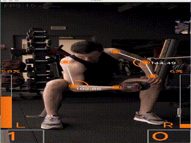

# AI-Training-Weight-Lift

AI Training Project #1: Weight Lift Counter. The app supports video load and live-camera-streaming. 

## Environment Setup

    conda create -n AI-Training python=3.7 
    conda install -n AI-Training tensorflow # Install tensorflow 
    conda install -n AI-Training -c conda-forge opencv # Install opencv
    conda activate AI-Training # Activate virtual environment
    pip install mediapipe # Install mediapipe # install mediapipe
    python -c 'import tensorflow as tf; print(tf.__version__)' # Check setup

## Run App
   

For video file import:
    
    python run.py -v resource/weight_lift3.mp4
For live-camera-streaming:

    python live_streaming.py

## Demo
